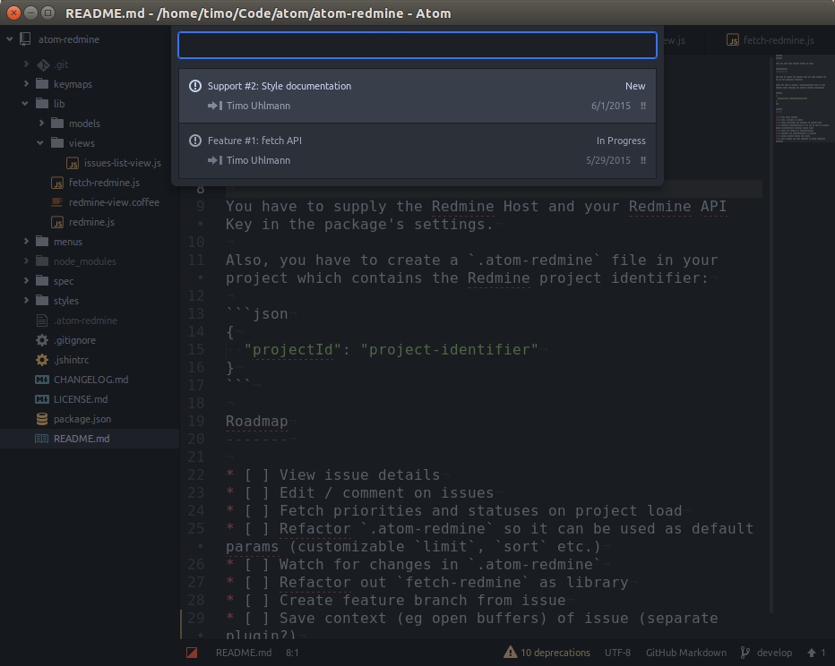

Redmine
=======

View and open your Redmine issues in Atom.



Configuration
-------------

You have to supply the Redmine Host and your Redmine API Key in the package's settings.

Also, you have to create a `.atom-redmine` file in your project which contains the Redmine project identifier:

```json
{
  "projectId": "project-identifier"
}
```

Roadmap
-------

* [ ] :exclamation: Add specs
* [ ] View issue details
* [ ] Edit / comment on issues
* [ ] Fetch priorities and statuses on project load
* [ ] Refactor `.atom-redmine` so it can be used as default params (customizable `limit`, `sort` etc.)
* [ ] Watch for changes in `.atom-redmine`
* [ ] Refactor out `fetch-redmine` as library
* [ ] Create feature branch from issue
* [ ] Save context (eg open buffers) of issue (separate plugin?)
